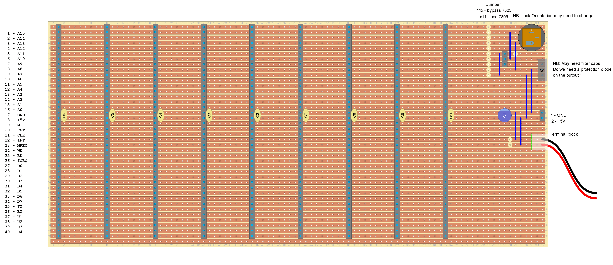

# RC2014 compatible backplane

A 9-slot `RC2014 v1.0` compatible backplane with power, based on the [RC2014 veroboard backplane](https://rc2014.co.uk/backplanes/veroboard-back-plane/).

This backplane provides 9 `v1.0` bus slots with power rails.

The power is delivered via either:

- Barrel jack (unregulated DC to +12v)
- Terminal block (+5V regulated DC)
- Header pins (+5V regulated DC)

The power system features a 7805 regulator which can be bypassed with a jumper.

## BOM

Part | Count | Description
--- | --- | ---
H1-9 | 9 | 40-pin 0.1" SIL female pin header
H10 | 1 | 3-pin 0.1" SIL male pin header (+ jumper)
H11 | 1 | 2-pin 0.1" SIL male pin header
C1 | 1 | 100uF electrolytic capacitor
C2-C10 | 9 | 100nF ceramic capacitor
D1 | 1 | 7805 voltage regulator (TO220 package)

Plus a barrel jack + 2 wire terminal block.

